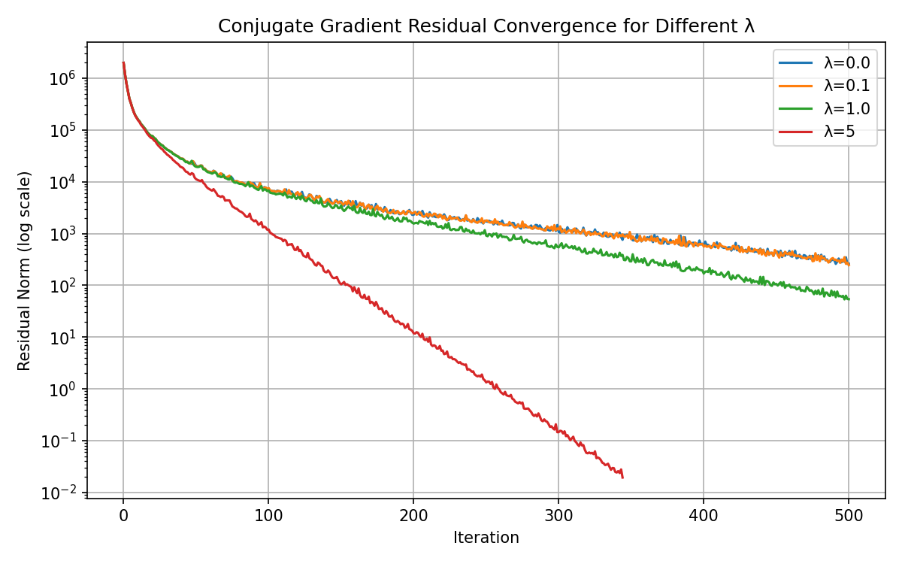
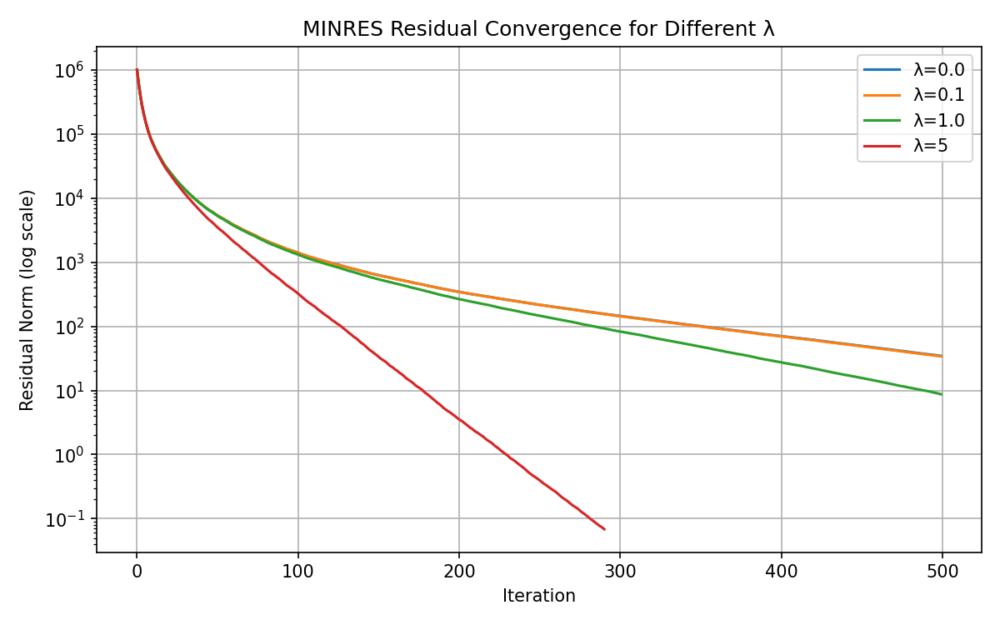

## Algebra-based Movie Recommendation

This project implements a **numerical linear algebra approach to movie recommendation**, using the MovieLens data set and large sparse least–squares problems.  
Instead of treating recommendation as a pure machine-learning black box, the system is formulated as a **regularized linear system** and solved with **iterative Krylov methods** (Conjugate Gradient and MINRES) on a very large, extremely sparse design matrix.

The repository mainly contains:

- **`data/`**: raw MovieLens CSV files.
- **``**: timestamped experiment folders with solver results, residual curves and metadata.
- **`README.md`**: this documentation.

> Note: the core solver code and notebooks that generate these experiments live outside this minimal submission directory; this repo focuses on the **numerical results and experiment artefacts**.

---

## Problem Formulation

We model the recommendation task as a **regularized least–squares problem**
\[
\min_x \; \|Ax - b\|_2^2 + \lambda \|x\|_2^2,
\]
where:

- **\(A \in \mathbb{R}^{m \times n}\)**: extremely large, **very sparse** design matrix encoding user–item interactions.
  - In the latest run (see `metadata.json`) we have:
    - **`A_shape = (20000263, 165237)`**
    - **`A_nnz   = 40000526`**
- **\(b \in \mathbb{R}^m\)**: vector of (shifted/normalized) observed ratings.
- **\(x \in \mathbb{R}^n\)**: parameter vector (e.g. latent factors or per-movie coefficients) from which predictions are derived.
- **\(\lambda \ge 0\)**: Tikhonov regularization parameter that trades off data fit vs. stability.

The corresponding **normal equations** are
\[
(A^\top A + \lambda I)x = A^\top b,
\]
which are **symmetric** and (for \(\lambda > 0\)) **positive definite**.  
This motivates the use of **Conjugate Gradient (CG)** and **MINRES** on the normal equations (or closely related symmetric systems), while carefully tracking convergence through residual norms.

---

## Data Layout

All data live under `data/` and come from the MovieLens dataset:

- **`data/rating.csv`**: user–movie ratings.  
  This is the primary input used in the experiments; its relative path appears as `csv_path` in the metadata.
- **`data/movie.csv`**: movie metadata (titles, genres).
- **`data/tag.csv`** and **`data/genome_tags.csv` / `data/genome_scores.csv`**: user and genome-style tag information.
- **`data/link.csv`**: mapping between MovieLens IDs and external IDs (e.g. IMDB).

In the experiments, `rating.csv` is transformed into a sparse matrix `A` and a right-hand side vector `b`. The other CSVs are available for further analysis (e.g. interpreting factors or building user-facing recommendation demos) but are not strictly needed to reproduce the numerical linear algebra experiments.

---

## Experiment Structure

Each experiment run is stored in a timestamped folder under ``, e.g.:

- **`exp_20251216_105921/`**

Every experiment folder has the same structure:

- **`metadata.json`**: configuration and high-level statistics.
  - **`csv_path`**: relative path to the ratings CSV used (here `data/rating.csv`).
  - **`lambda_values`**: list of regularization parameters \(\lambda\) explored in the run.
  - **`target_rel`**: target relative residual tolerance for the outer stopping criterion.
  - **`minres_tol_internal`, `minres_maxiter`**: MINRES solver tolerance and maximum iterations.
  - **`cg_internal_tol`, `cg_maxiter`**: CG solver tolerance and maximum iterations.
  - **`A_shape`, `A_nnz`**: size and sparsity of the system matrix.
- **Solver result files**:
  - **`cg_results.npz`**, **`cg_results.pkl`**: numerical logs / arrays for Conjugate Gradient.
  - **`minres_results.npz`**, **`minres_results.pkl`**: analogous results for MINRES.
- **Performance and residual plots**:
  - **`cg_performance.png`**, **`cg_residuals.png`**
  - **`minres_performance.png`**, **`minres_residuals.png`**

This layout makes it easy to:

- Compare runs with different hyperparameters (e.g. different `lambda_values` or tolerances).
- Re-use the saved residual histories for plotting or further analysis.
- Post-process the results without recomputing the expensive Krylov iterations.

---

## Latest Experiment: Residual Convergence Plots

The **most recent experiment** at the time of this README is:

- **`exp_20251216_105921/`**

Below are the **residual convergence plots** for CG and MINRES using different values of \(\lambda\), taken directly from this folder.

### Conjugate Gradient Residuals

**Interpretation (high level):**

- Residual norms are plotted on a **logarithmic scale** vs. iteration count.
- Different curves correspond to different regularization strengths \(\lambda \in \{0.0, 0.1, 1.0, 5\}\).
- Larger \(\lambda\) improves conditioning and typically yields **faster residual decay** (e.g. \(\lambda = 5\) converges dramatically faster here), but may over-regularize the model.

### MINRES Residuals

**Interpretation (high level):**

- MINRES, like CG, exploits the symmetry of the system and also tracks residual norms on a log scale.
- For small \(\lambda\), MINRES sees slower residual decay, reflecting the challenging conditioning of \(A^\top A\).
- For larger \(\lambda\), the method converges much more rapidly, again trading approximation accuracy for numerical stability and speed.

Together, these two plots let you visually compare:

- **Solver behavior** (CG vs. MINRES) on the *same* underlying linear systems.
- **Impact of regularization** on convergence speed and stability.

---

## How the (External) Code is Organized

While the core solver scripts / notebooks are kept outside this minimal artefact repository, they follow a simple conceptual structure:

- **Data loading and matrix construction**
  - Read `data/rating.csv`.
  - Build a large sparse matrix `A` (e.g. CSR format) and vector `b`.
  - Optionally normalize ratings or apply biases (global mean, user and/or item offsets).
- **Regularized system setup**
  - Choose one or more \(\lambda\) values.
  - For each \(\lambda\), define a linear operator corresponding to \((A^\top A + \lambda I)\) without forming the dense matrix explicitly.
- **Iterative solvers**
  - Run **Conjugate Gradient** with:
    - `cg_internal_tol`, `cg_maxiter` as seen in `metadata.json`.
    - Logging of iteration count, residual norms, and possibly timing information.
  - Run **MINRES** with:
    - `minres_tol_internal`, `minres_maxiter`.
    - Similar logging infrastructure.
- **Experiment logging**
  - Save raw results as `.npz` and `.pkl` into a new timestamped subdirectory under ``.
  - Generate convergence and performance plots as `.png` files.
  - Write a corresponding `metadata.json` capturing configuration and key problem statistics.

If you integrate the external code into this repository, a typical directory layout might look like:

- **`src/`** (or `notebooks/`):
  - **Data preprocessing** (building `A` and `b`).
  - **Solvers** (wrapping CG / MINRES and logging).
  - **Experiment runner** (or notebook) that produces the folders under ``.

---

## Reproducing / Extending the Experiments

To extend this work or reproduce similar experiments:

- **Change the dataset or filtering**:
  - Subsample users, movies or time ranges to study scalability.
- **Vary the regularization**:
  - Explore a finer grid of \(\lambda\) values and inspect their effect on convergence and test error.
- **Try different Krylov methods or preconditioners**:
  - For example, test preconditioned CG, LSQR, or other symmetric solvers on the same system.
- **Connect to recommendation metrics**:
  - Use the solved parameters \(x\) to generate predicted ratings and evaluate using RMSE, MAE or ranking-based metrics (NDCG, MAP) on held-out data.

The existing `` directory provides a solid baseline of residual behavior for large-scale, regularized linear systems arising from a real recommender dataset.

---

## Summary

- This project treats movie recommendation as a **huge regularized linear system** and studies **Krylov solver behavior** on it.
- The repository contains **MovieLens data**, **experiment artefacts** (results + plots), and **configuration metadata** describing the systems solved.
- The **latest experiment’s CG and MINRES residual plots** are embedded above and illustrate how regularization strength \(\lambda\) affects convergence.
